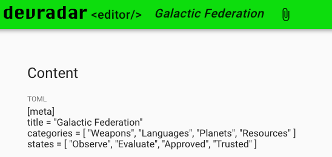

# devradar editor

[](https://microbadger.com/images/anoff/devradar)
[](https://greenkeeper.io/)
[](https://cloud.drone.io/anoff/devradar)
[](https://app.netlify.com/sites/devradar/deploys)


> Visit [devradar.io](https://devradar.io) for an introduction

This repository holds the Web Application for the devradar editor.
An online editor to create your own personal techradar - for individuals and teams.
The devradar editor provides a GUI to manage **blips** (items on the radar e.g. _C++_, _SCRUM_).
Instead of assigning a static level of expertise for a given blip the devradar uses an iterative approach, where you define **changes** to a blip by providing a _date_, _new state_ and _reasoning_ how your expertise changed.

<!-- TOC depthFrom:2 -->

- [Features](#features)
- [Usage](#usage)
  - [Personal devradar](#personal-devradar)
  - [devradar for teams and organizations](#devradar-for-teams-and-organizations)
- [Setup](#setup)
  - [Tech stack](#tech-stack)
- [License & Attributions](#license--attributions)

<!-- /TOC -->

## Features

1. customize adoption levels
1. define quadrant categories
1. create radar blips via GUI
1. keep track of blip adoption
1. full privacy - all data is stored locally in the browser
1. import/export your devradar via human-readable `.toml` files
1. share your devradar via URL
1. host your own devradar editor on premise with docker

## Usage

You can customize the meta properties of the devradar by going to the settings screen at [editor.devradar.io/#/settings](https://editor.devradar.io/#/settings).

### Personal devradar

Use a personal devradar to keep track of your skills.
This can be helpful tool to be aware of your own portfolio or also use it as part of your CV like I do ([radar.anoff.io](//radar.anoff.io)).

For creating your personal devradar the [NIH proficiency scale](https://hr.nih.gov/working-nih/competencies/competencies-proficiency-scale) may be a good reference.
The upper four categories of this scale are the defaults when you create a new devradar.

```toml
[meta]
title = "Rick's Radar"
categories = [ "Tools", "Techniques", "Platforms", "Frameworks" ]
states = [ "Novice", "Intermediate", "Advanced", "Expert" ]
```

### devradar for teams and organizations

It often makes sense to track technology that is used within an organization or a team.
Depending on the scope you may want to fiddle with the blip categories and the abstraction level of blips you enter.
The classic Thoughtworks categories make a good start if you want to create a devradar with a broad scope.

```toml
[meta]
title = "ACME devradar"
categories = [ "Tools", "Techniques", "Platforms", "Frameworks" ]
states = [ "Hold", "Assess", "Trial", "Adopt" ]
```

You can also use the devradar for non-tech related things:



## Setup

See [setup.md](setup.md) for instructions on the different setup options.

### Tech stack

The devradar itself is build with Vue.js.
For easier deployment the editor comes pre-built as a docker image [anoff/devradar](https://cloud.docker.com/repository/docker/anoff/devradar).
For the docker image nginx-alpine is used as a base image which brings the final image size to < 15MB.


## License & Attributions

Copyright 2019 Andreas Offenhaeuser <https://anoff.io>

All devradar code is licensed under [AGPL-3.0](LICENSE) see [tl;dr; legal](https://tldrlegal.com/license/gnu-affero-general-public-license-v3-(agpl-3.0)) for a quick overview of what this means.

The radar visualization is inspired by [Urban Sanden](https://github.com/urre/radar/), licensed under [MIT](https://github.com/urre/radar/blob/502b57332467e68819ce69eeb65f8432129d69b9/LICENSE).
